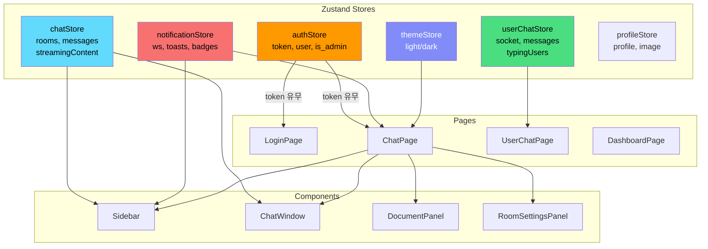
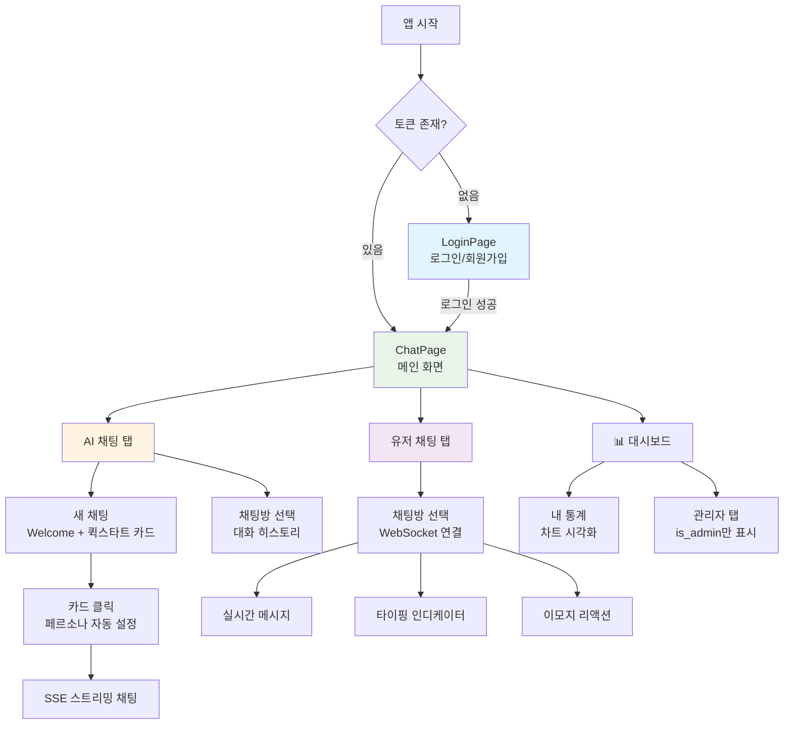

# RAG AI Chatbot - Web Frontend

> 문서 기반 AI 채팅 + 실시간 소셜 플랫폼 **웹 프론트엔드**  
> **3차 개인 프로젝트** | ⚡ **바이브 코딩** (Claude AI 페어 프로그래밍) | 🤖 **LLM 활용**

[](https://reactjs.org)
[](https://typescriptlang.org)
[](https://vitejs.dev)
[](https://tailwindcss.com)
[](https://zustand-demo.pmnd.rs)

---

## 📋 프로젝트 개요

RAG AI Chatbot 웹 프론트엔드는 문서 기반 AI 채팅과 실시간 소셜 채팅을 통합한 풀스택 서비스의 **웹 클라이언트**입니다.  
React + TypeScript + Zustand 기반으로 SSE 스트리밍, WebSocket 실시간 채팅, 다크/라이트 테마 등을 구현하였습니다.

> ⚡ **바이브 코딩이란?**  
> 이 프로젝트는 **Claude AI와 전 과정 페어 프로그래밍**으로 개발되었습니다.  
> 설계 → 구현 → 디버깅 → 리팩토링의 모든 과정에서 LLM을 적극 활용하여  
> AI 도구의 실무 활용 역량을 직접 증명한 프로젝트입니다.

### 개발 정보

| 항목 | 내용 |
|------|------|
| 개발 기간 | 2025.11 ~ 2026.02 (4개월) |
| 개발 인원 | 1인 (개인 프로젝트) |
| 개발 방식 | 바이브 코딩 (Claude AI 페어 프로그래밍) |
| 백엔드 레포 | [RAG-AI-Chatbot_backend](https://github.com/LSY1007/RAG-AI-Chatbot_backend) |
| 모바일 레포 | [RAG-AI-Chatbot_mobile](https://github.com/LSY1007/RAG-AI-Chatbot_mobile) |

---

## 🛠️ 기술 스택

### Core
- **Language**: TypeScript 5.5.3
- **Framework**: React 18.3.1
- **Build Tool**: Vite 5.4.0
- **Routing**: React Router DOM 6.24.0

### State Management
- **Zustand 4.5.4**: 가볍고 직관적인 상태 관리

### Styling
- **TailwindCSS 3.4.7**: 유틸리티 우선 CSS 프레임워크 (darkMode: 'class')
- **PostCSS + Autoprefixer**: CSS 후처리

### HTTP & 실시간 통신
- **Axios 1.7.0**: HTTP 클라이언트 (인터셉터 기반 JWT 자동 주입)
- **WebSocket (Native)**: 실시간 유저 채팅
- **SSE (fetch + ReadableStream)**: AI 응답 스트리밍

### UI
- **Recharts**: 관리자 대시보드 차트 (AreaChart / BarChart / PieChart)
- **react-markdown**: AI 응답 마크다운 렌더링

### 통신 방식별 사용 기술

| 통신 방식 | 기술 | 용도 |
|-----------|------|------|
| REST API | Axios 1.7.0 + JWT | 인증/채팅/문서/통계 API 호출 |
| **SSE** | fetch + ReadableStream | **AI 응답 실시간 스트리밍** |
| **WebSocket** | Native WebSocket | **실시간 유저 채팅/알림** |

### 의존성 요약

```json
{
  "dependencies": {
    "axios": "^1.7.0",
    "react": "^18.3.1",
    "react-dom": "^18.3.1",
    "react-markdown": "^10.1.0",
    "react-router-dom": "^6.24.0",
    "recharts": "^3.8.1",
    "zustand": "^4.5.4"
  },
  "devDependencies": {
    "typescript": "^5.5.3",
    "vite": "^5.4.0",
    "tailwindcss": "^3.4.7",
    "@vitejs/plugin-react": "^4.3.1"
  }
}
```

---

## 📂 프로젝트 구조

```
web/src/
├── api/
│   ├── axios.ts                # Axios 인스턴스
│   │                           #   - sessionStorage 토큰 자동 주입
│   │                           #   - 401 시 세션 초기화 + 리다이렉트
│   └── index.ts                # API 함수 모음
│                               #   - authApi (login/register/me)
│                               #   - chatApi (rooms/stream/history/personas)
│                               #   - documentApi (upload/list/delete)
│                               #   - userChatApi (rooms/messages/friends)
│                               #   - statsApi (my/admin)
│                               #   - profileApi (update/uploadImage)
│
├── stores/                     # Zustand 전역 상태
│   ├── authStore.ts            # 인증 상태
│   │                           #   - token, user (is_admin 포함)
│   │                           #   - login() → API 호출 후 sessionStorage 저장
│   │                           #   - logout() → 세션 초기화
│   ├── chatStore.ts            # AI 채팅 상태
│   │                           #   - rooms, messages, currentRoomId
│   │                           #   - SSE 스트리밍 (streamingContent, isStreaming)
│   │                           #   - sendMessage() → fetch + ReadableStream
│   │                           #   - newChat() → 방 생성 후 welcome 화면
│   ├── userChatStore.ts        # 유저 채팅 상태
│   │                           #   - WebSocket 연결/재연결
│   │                           #   - typingUsers, messages, reactions
│   │                           #   - sendTyping() / sendStopTyping()
│   ├── notificationStore.ts    # 실시간 알림 상태
│   │                           #   - 알림 WebSocket 연결 관리
│   │                           #   - toasts (화면 우상단 토스트)
│   │                           #   - badges (사이드바 배지 카운트)
│   ├── profileStore.ts         # 프로필 상태
│   │                           #   - profile 데이터, 이미지 업로드
│   └── themeStore.ts           # 테마 상태
│                               #   - 'light' | 'dark'
│                               #   - localStorage 영속 저장
│                               #   - document.documentElement classList 토글
│
├── components/
│   ├── layout/
│   │   └── Sidebar.tsx         # 메인 사이드바
│   │                           #   - AI 채팅 방 목록
│   │                           #   - 유저 채팅 방 목록
│   │                           #   - 📊 대시보드 버튼
│   │                           #   - 프로필 (하단)
│   ├── chat/
│   │   ├── ChatWindow.tsx      # AI 채팅 메인 윈도우
│   │   │                       #   - 퀵스타트 6종 카드 (빈 채팅 시 welcome 화면)
│   │   │                       #   - SSE 스트리밍 커서 애니메이션
│   │   │                       #   - 타이핑 인디케이터 (3점 바운싱)
│   │   │                       #   - react-markdown 렌더링
│   │   │                       #   - 웹 검색 출처 URL 표시
│   │   ├── DocumentPanel.tsx   # 문서 관리 패널
│   │   │                       #   - 파일 업로드 (드래그 앤 드롭)
│   │   │                       #   - 문서 목록 / 삭제
│   │   └── RoomSettingsPanel.tsx # 채팅방 설정 패널
│   │                           #   - 페르소나 선택 (6종 + 커스텀)
│   │                           #   - 웹 검색 토글
│   │                           #   - 채팅방 제목 변경
│   └── profile/
│       ├── ProfileModal.tsx    # 프로필 편집 모달
│       │                       #   - 사용자명 / 상태메시지 변경
│       │                       #   - 프로필 이미지 업로드
│       └── Avatar.tsx          # 아바타 컴포넌트
│                               #   - 이미지 있으면 표시 / 없으면 이니셜
│
├── pages/
│   ├── LoginPage.tsx           # 로그인 / 회원가입 탭 전환
│   ├── ChatPage.tsx            # 메인 채팅 페이지
│   │                           #   - AI채팅 탭 / 유저채팅 탭 전환
│   │                           #   - Sidebar + ChatWindow 레이아웃
│   ├── UserChatPage.tsx        # 유저 실시간 채팅 페이지
│   │                           #   - 메시지 검색 (SearchPanel)
│   │                           #   - 이미지 인라인 미리보기 + 전체화면 모달
│   │                           #   - 이모지 리액션 피커
│   │                           #   - 답장 / 수정 / 삭제
│   └── DashboardPage.tsx       # 통계 대시보드 페이지
│                               #   - 내 통계 탭 (7일 차트)
│                               #   - 관리자 탭 (is_admin만 표시)
│
├── types/
│   └── index.ts                # 전역 타입 정의
│                               #   - User, ChatRoom, ChatMessage
│                               #   - UserChatMessage, MessageReaction
│                               #   - Document, Persona, Stats
│
├── App.tsx                     # 루트 컴포넌트
│                               #   - 토큰 유무로 LoginPage/ChatPage 분기
│                               #   - 알림 WS 자동 재연결 (3초 인터벌)
│                               #   - 테마 초기화 (useThemeInit)
│                               #   - 토스트 컨테이너
│                               #   - 다크/라이트 토글 버튼 (우하단 고정)
├── index.css                   # TailwindCSS 기본 + 타이핑 애니메이션
└── main.tsx                    # 엔트리 포인트
```

---

## 🔑 핵심 기능

### 1. AI 채팅 (SSE 스트리밍)

퀵스타트 카드를 클릭하면 자동으로 페르소나가 설정되어 채팅이 시작됩니다.

```typescript
// chatStore.ts - SSE 스트리밍 수신
sendMessage: async (question) => {
    const { currentRoomId } = get();
    const token = sessionStorage.getItem('access_token');

    set(s => ({ messages: [...s.messages, { role: 'user', content: question }], isStreaming: true }));

    const response = await fetch('http://localhost:8000/api/v1/chat/stream', {
        method: 'POST',
        headers: { 'Content-Type': 'application/json', Authorization: `Bearer ${token}` },
        body: JSON.stringify({ question, room_id: currentRoomId }),
    });

    const reader = response.body!.getReader();
    const decoder = new TextDecoder();
    let buffer = '', fullContent = '';

    while (true) {
        const { done, value } = await reader.read();
        if (done) break;
        buffer += decoder.decode(value, { stream: true });
        const lines = buffer.split('\n');
        buffer = lines.pop() || '';

        for (const line of lines) {
            if (!line.startsWith('data: ')) continue;
            const data = JSON.parse(line.slice(6));
            if (data.type === 'chunk') {
                fullContent += data.content;
                set({ streamingContent: fullContent });      // 실시간 렌더링
            } else if (data.type === 'done') {
                set(s => ({
                    messages: [...s.messages, { role: 'assistant', content: fullContent,
                        sources: data.sources, web_sources: data.web_sources }],
                    isStreaming: false, streamingContent: ''
                }));
                get().fetchRooms();  // 사이드바 방 목록 갱신
            }
        }
    }
},
```

### 2. 퀵스타트 카드 (AI 페르소나 6종)

새 채팅 클릭 시 welcome 화면이 나타나며, 카드를 클릭하면 자동으로 채팅이 시작됩니다.

```typescript
// ChatWindow.tsx - 퀵스타트 카드 클릭 핸들러
const QUICK_STARTS = [
    { icon: '👔', label: '면접 연습',   desc: '기술 면접 준비',    persona_id: 'interviewer',   web_search: false },
    { icon: '🌐', label: '웹 검색',     desc: '최신 정보 검색',    persona_id: 'default',       web_search: true  },
    { icon: '💻', label: '코드 리뷰',   desc: '코드 개선 제안',    persona_id: 'code_reviewer', web_search: false },
    { icon: '🗣️', label: '영어 튜터',   desc: '영어 회화 & 문법',  persona_id: 'english_tutor', web_search: false },
    { icon: '✍️', label: '글쓰기 코치', desc: '글 다듬기',         persona_id: 'writer',        web_search: false },
    { icon: '⚖️', label: '토론 파트너', desc: '논리력 훈련',       persona_id: 'debate',        web_search: false },
];

const handleQuickStart = async (item: typeof QUICK_STARTS[0]) => {
    if (!currentRoomId) await newChat();  // 방이 없으면 자동 생성
    const { currentRoomId: roomId } = useChatStore.getState();
    await updateRoomSettings(roomId!, {
        persona_id: item.persona_id,
        web_search_enabled: item.web_search,
    });
    await sendMessage(item.first_message);  // 안내 메시지 자동 전송
};
```

### 3. 실시간 유저 채팅 (WebSocket)

```typescript
// userChatStore.ts - WebSocket 연결 및 이벤트 처리
connectWs: (roomId, token) => {
    const socket = new WebSocket(
        `ws://localhost:8000/api/v1/user-chat/ws/${roomId}?token=${token}`
    );

    socket.onmessage = (event) => {
        const { type, data } = JSON.parse(event.data);
        switch (type) {
            case 'message':
                set(s => ({ messages: [...s.messages, data] }));
                break;
            case 'typing':
                set(s => ({ typingUsers: [...s.typingUsers, data] }));
                setTimeout(() => {
                    set(s => ({
                        typingUsers: s.typingUsers.filter(u => u.user_id !== data.user_id)
                    }));
                }, 3000);  // 3초 후 자동 해제
                break;
            case 'reaction_updated':
                set(s => ({
                    messages: s.messages.map(m =>
                        m.id === data.message_id ? { ...m, reactions: data.reactions } : m
                    )
                }));
                break;
            case 'read_updated':
                // 읽음 확인 처리
                break;
        }
    };

    // 비정상 종료 시 재연결 (인증 실패 4001 제외)
    socket.onclose = (e) => {
        if (e.code !== 1000 && e.code !== 4001) {
            const t = sessionStorage.getItem('access_token');
            if (t) setTimeout(() => connectWs(roomId, t), 3000);
        }
    };
},
```

#### 지원 기능
- ✅ 실시간 메시지 송수신
- ✅ 타이핑 인디케이터 (3초 자동 해제)
- ✅ 이모지 리액션 8종 (👍❤️😂😮😢🔥🎉👀)
- ✅ 메시지 답장 / 수정 / 소프트 삭제
- ✅ 읽음 확인
- ✅ 이미지 인라인 미리보기 + 전체화면 모달
- ✅ 메시지 검색 (키워드 하이라이트 + 스크롤 이동)
- ✅ 친구 추가 / 수락 / 거절

### 4. 다크/라이트 테마

```typescript
// themeStore.ts
interface ThemeState {
    theme: 'light' | 'dark';
    toggleTheme: () => void;
}

export const useThemeStore = create<ThemeState>()(
    persist(
        (set, get) => ({
            theme: 'light',
            toggleTheme: () => {
                const next = get().theme === 'light' ? 'dark' : 'light';
                document.documentElement.classList.toggle('dark', next === 'dark');
                set({ theme: next });
            },
        }),
        { name: 'theme-storage' }  // localStorage 영속 저장
    )
);
```

```javascript
// tailwind.config.js
export default {
    darkMode: 'class',  // 'dark' 클래스 기반 테마 전환
    content: ['./index.html', './src/**/*.{js,ts,jsx,tsx}'],
    theme: { extend: {} },
    plugins: [],
};
```

### 5. 관리자 대시보드

```typescript
// DashboardPage.tsx - is_admin 기반 탭 분기
const DashboardPage: React.FC = () => {
    const { user } = useAuthStore();
    const [tab, setTab] = useState<'my' | 'admin'>('my');

    return (
        <div>
            <div className="flex gap-2">
                <button onClick={() => setTab('my')}>👤 내 통계</button>
                {user?.is_admin && (
                    <button onClick={() => setTab('admin')}>🛡 관리자</button>
                )}
            </div>
            {tab === 'my' ? <MyStats /> : <AdminStats />}
        </div>
    );
};
```

#### 차트 구성 (Recharts)
| 차트 | 설명 |
|------|------|
| AreaChart | 최근 7/14일 AI·유저 채팅 추이 |
| BarChart | 페르소나별 사용 횟수 |
| PieChart | 업로드 문서 타입 분포 |

### 6. Axios 인터셉터 (JWT 자동 관리)

```typescript
// api/axios.ts
const api = axios.create({ baseURL: 'http://localhost:8000' });

// 요청 인터셉터: sessionStorage에서 토큰 자동 주입
api.interceptors.request.use((config) => {
    const token = sessionStorage.getItem('access_token');
    if (token) config.headers.Authorization = `Bearer ${token}`;
    return config;
});

// 응답 인터셉터: 401 시 세션 초기화 + 로그인 페이지 이동
api.interceptors.response.use(
    (response) => response,
    (error) => {
        if (error.response?.status === 401) {
            const url = error.config?.url || '';
            if (!url.includes('/auth/')) {
                sessionStorage.clear();
                window.location.href = '/';
            }
        }
        return Promise.reject(error);
    }
);
```

---

## 📡 연동 API (백엔드 FastAPI)

### 인증
| Method | Endpoint | 설명 |
|--------|----------|------|
| POST | `/api/v1/auth/register` | 회원가입 |
| POST | `/api/v1/auth/login` | 로그인 → access_token 반환 |
| GET | `/api/v1/auth/me` | 내 정보 조회 |

### AI 채팅
| Method | Endpoint | 설명 |
|--------|----------|------|
| GET | `/api/v1/chat/personas` | 페르소나 목록 |
| GET | `/api/v1/chat/rooms` | 채팅방 목록 |
| POST | `/api/v1/chat/rooms` | 채팅방 생성 |
| DELETE | `/api/v1/chat/rooms/{id}` | 채팅방 삭제 |
| GET | `/api/v1/chat/history` | 대화 기록 |
| **POST** | **`/api/v1/chat/stream`** | **SSE 스트리밍 AI 답변** |
| PUT | `/api/v1/chat/rooms/{id}/settings` | 페르소나/웹검색 설정 |
| POST | `/api/v1/chat/rooms/{id}/summary` | 대화 요약 |

### 문서
| Method | Endpoint | 설명 |
|--------|----------|------|
| POST | `/api/v1/documents/upload` | 문서 업로드 + 임베딩 |
| GET | `/api/v1/documents/` | 문서 목록 |
| DELETE | `/api/v1/documents/{id}` | 문서 삭제 + 벡터 제거 |

### 유저 채팅
| Method | Endpoint | 설명 |
|--------|----------|------|
| **WS** | **`/api/v1/user-chat/ws/{room_id}?token=JWT`** | **WebSocket 채팅** |
| WS | `/api/v1/user-chat/notifications?token=JWT` | 실시간 알림 |
| GET | `/api/v1/user-chat/rooms` | 채팅방 목록 |
| POST | `/api/v1/user-chat/rooms/dm/{friend_id}` | DM 방 생성 |
| GET | `/api/v1/user-chat/friends` | 친구 목록 |
| GET | `/api/v1/user-chat/users/search` | 유저 검색 |

### 통계
| Method | Endpoint | 설명 | 권한 |
|--------|----------|------|------|
| GET | `/api/v1/stats/my` | 내 통계 (7일) | 일반 |
| GET | `/api/v1/stats/admin/overview` | 전체 현황 (14일) | 관리자 |
| GET | `/api/v1/stats/admin/users` | 유저 목록 | 관리자 |
| PATCH | `/api/v1/stats/admin/users/{id}/toggle` | 활성/비활성 | 관리자 |

---

## 🔄 상태 관리 흐름



---

## ⚙️ 환경 설정

### 환경 변수 (`.env`)
```env
VITE_API_URL=http://localhost:8000
```

### vite.config.ts
```typescript
import { defineConfig } from 'vite';
import react from '@vitejs/plugin-react';

export default defineConfig({
    plugins: [react()],
    server: {
        port: 5173,
    },
});
```

### tailwind.config.js
```javascript
export default {
    darkMode: 'class',  // 다크모드: class 전략
    content: ['./index.html', './src/**/*.{js,ts,jsx,tsx}'],
    theme: { extend: {} },
    plugins: [],
};
```

---

## 🚀 시작하기

### 필수 요구사항
- Node.js 18+
- 백엔드 서버 실행 중 (port: 8000)

### 설치 및 실행

```bash
# 1. 저장소 클론
git clone https://github.com/LSY1007/RAG-AI-Chatbot_front.git
cd RAG-AI-Chatbot_front

# 2. 의존성 설치
npm install

# 3. 환경 변수 설정 (.env 파일 생성)
echo "VITE_API_URL=http://localhost:8000" > .env

# 4. 개발 서버 실행
npm run dev
# http://localhost:5173
```

### 프로덕션 빌드
```bash
npm run build
# dist/ 디렉토리에 빌드 파일 생성
```

---

## 📱 화면 구성

### 주요 화면 흐름



---

## 🐛 트러블슈팅

### 1. 새 채팅 클릭 시 Welcome 화면이 안 보임

**증상**: 새 채팅 클릭 시 빈 채팅창만 표시

**원인**: `chatStore.newChat()`이 방을 즉시 생성하여 `currentRoomId`가 설정됨 → Welcome 조건 불충족

**해결**:
```typescript
// ChatWindow.tsx - messages가 없으면 항상 welcome 화면
// 기존: !currentRoomId && messages.length === 0
// 수정: messages.length === 0 && !isStreaming
if (messages.length === 0 && !isStreaming) {
    return <WelcomeScreen />;  // 퀵스타트 카드 표시
}
```

### 2. SSE 청크 누락 (스트리밍 끊김)

**증상**: AI 응답이 중간에 끊기거나 청크가 누락됨

**원인**: `fetch`의 `ReadableStream` 버퍼링 문제

**해결**:
```typescript
// buffer 기반 라인 파싱으로 해결
buffer += decoder.decode(value, { stream: true });
const lines = buffer.split('\n');
buffer = lines.pop() || '';  // 마지막 불완전한 줄은 buffer에 유지
```

### 3. JWT 토큰 키 불일치 (401 반복)

**증상**: 로그인 성공 후 모든 API 401 응답

**원인**: `authStore.login()`에서 token 저장 키가 axios.ts에서 읽는 키와 불일치

**해결**:
```typescript
// authStore.ts - 저장 키 통일
sessionStorage.setItem('access_token', data.access_token);

// axios.ts - 동일한 키로 읽기
const token = sessionStorage.getItem('access_token');
```

### 4. WebSocket 재연결 403

**증상**: 연결 끊김 후 재연결 시 403 에러

**원인**: 클로저로 캐시된 만료 토큰으로 재연결 시도

**해결**:
```typescript
socket.onclose = (e) => {
    if (e.code !== 1000 && e.code !== 4001) {
        // 항상 sessionStorage에서 최신 토큰 읽기
        const t = sessionStorage.getItem('access_token');
        if (t) setTimeout(() => connectWs(roomId, t), 3000);
    }
};
```

---

## 📝 개발 가이드

### 코드 컨벤션

```typescript
// 컴포넌트: PascalCase
const ChatWindow: React.FC = () => {
    // 변수/함수: camelCase
    const [streamingContent, setStreamingContent] = useState('');
    const handleSendMessage = async (question: string) => { };
};

// 상수: UPPER_SNAKE_CASE
const MAX_FILE_SIZE = 10 * 1024 * 1024;  // 10MB
const RECONNECT_DELAY = 3000;            // 3초
```

### Git 커밋 컨벤션
```
feat: 새로운 기능 추가
fix: 버그 수정
docs: 문서 수정
style: 코드 포맷팅
refactor: 코드 리팩토링
chore: 빌드, 설정 변경

예시:
feat: SSE 스트리밍 AI 응답 실시간 렌더링 구현
feat: 퀵스타트 카드 6종 페르소나 자동 연결
fix: JWT access_token 키 불일치 버그 수정
fix: WebSocket 재연결 시 만료 토큰 사용 버그 수정
style: 다크 테마 전체 슬라이드 적용
```

---

## 👨‍💻 개발자 정보

| 항목 | 내용 |
|------|------|
| 이름 | 이상연 |
| 이메일 | dltkddus50@naver.com |
| GitHub | [LSY1007](https://github.com/LSY1007) |
| 학력 | 방송통신대학교 컴퓨터과학과 재학 (2026.03~) |
| 수료 | 하이미디어 JAVA 풀스택 개발자 과정 (2026.02) |

## 🔗 관련 레포지토리

| 레포 | 설명 |
|------|------|
| [RAG-AI-Chatbot_backend](https://github.com/LSY1007/RAG-AI-Chatbot_backend) | Python FastAPI + LangChain + ChromaDB |
| [RAG-AI-Chatbot_front](https://github.com/LSY1007/RAG-AI-Chatbot_front) | React + TypeScript (현재) |
| [RAG-AI-Chatbot_mobile](https://github.com/LSY1007/RAG-AI-Chatbot_mobile) | React Native + Expo SDK 54 |

---

> 💡 **이 프로젝트는 Claude AI와의 바이브 코딩으로 개발되었습니다.**  
> 기획부터 구현까지 LLM을 적극 활용하여 AI 도구 실무 활용 역량을 직접 증명한 프로젝트입니다.

**RAG AI Chatbot** - LLM으로 만드는 새로운 AI 채팅 경험
